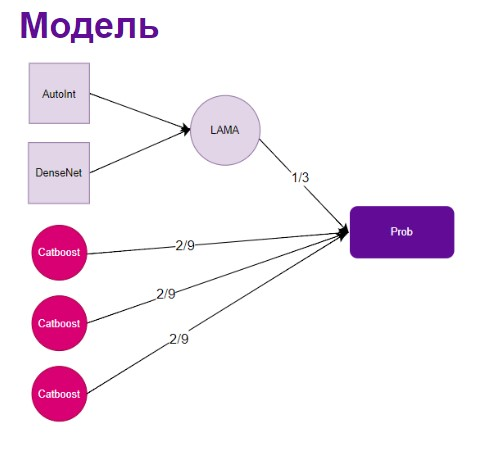

# Решение команды GG на It Purple Hack, кейс Сбера

## Задача
Модель машинного обучения
В качестве целевой переменной 
планирует, которая предсказывает на ежедневной основе отток 
зарплатных клиентов из банка до возникновения самого события оттока, используя 
данные поведения клиента: транзакции, продукты, мобильное приложение, 
терминалы, прочее.
В качастве целевой переменной - определение типа клиента (где 0 - клиент 
планирует продолжить получать ЗП на карту текущего банка, 1 - клиент 
сменить банк для начисления ЗП - будущий отток)

## Метрики:

- **Best Public score:** 0.77508
- **Best Private score:** 0.77203

## Структура проекта

Проект состоит из следующих основных частей:

1. **analytics** - модуль аналитики данных.
2. **feature_extraction_1** - модуль для извлечения признаков (часть 1).
3. **feature_extraction_2** - модуль для извлечения признаков (часть 2).
4. **main** - составление и обучение пайплайна

## Анализ данных и отбор признаков:

Провели анализ данных. Отобрали признаки по корреляции 95%, выделили категориальные признаки. На основе этих признаков построили модель catboost и отобрали топ90 признаков по важности. Нагенерировали новые фичи, такие как синусы, логирифмы, полиноминальные признаки и произвели повторный
отбор. Отбор проводили по feature importance и permutation importance: сначала убрали признаки с нулевой важностью, для отбора финальных признаков
использовали forward selection.

## Краткое описание пайплайна:

Попробовали Логистическую регрессию, MLP, catboost, xgboost, lightgbm, fttransformer. Лучше всего себя показал пайплайн из Autolnt + DenseNet
(LigthAutoML) + bagging catboost (x3).

